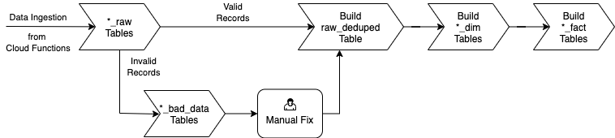

# gcp-covid19-businessintelligence
Repository for COVID19 data warehouse and business intelligence

### Sample Reports:    
1. **Top 10 COVID19 cases by country - Bar Chart Race Timeline** - This bar chart race timeline report is designed using the publicly available cloud based flourish.studio. The dataset in consideration is from April 2020 to January 2021.    

2. **COVID19 Worldwide - Today's Dashboard** - This dashboard shows the current state of COVID19 worldwide.  

### Docker Airflow Setup:  
**Pre-requisites:**  
1. Docker Engine up and running in local machine.  
2. GCP JSON key file for the service account.   
3. Python version 3.7.x  

To deploy airflow locally, navigate to docker_airflow folder and run the following  command  
`docker-compose -f docker-compose.yml up -d`  

Once airflow webserver is up and running, go to http://localhost:8080/admin/ and set connection parameters for bigquery and google cloud defaults.  

**Airflow Data Pipeline:**  
