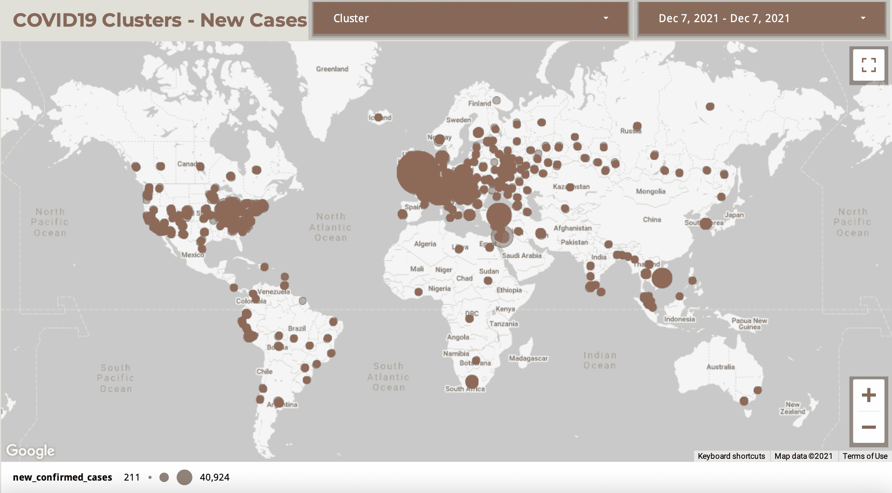

## COVID19 Clusters - New Cases

This Looker Studio report shows the COVID19 new cases metric for various cluster size/dimensions as of December 7,2021.

*Report Link:*  
[https://lookerstudio.google.com/reporting/30781a77-8622-43ea-a170-486de84f161b/page/PnK0B?s=hMDBUrvUIwQ](https://lookerstudio.google.com/reporting/30781a77-8622-43ea-a170-486de84f161b/page/PnK0B?s=hMDBUrvUIwQ)  

*BigQuery SQL Code:*  

~~~~
SELECT
   CAST(a.lat AS STRING) || ',' || CAST(a.lng AS STRING) AS lat_lng,
   a.cases_timestamp,
   a.country_code_iso2,
   a.country_code_iso3,  
   a.lat,
   a.lng,
   a.geo_point,
   a.precision,
   a.cluster_description,          
   a.new_confirmed_cases,    
   a.new_deaths,     
   a.new_recovered_cases,  
   a.active_cases
FROM abar_bq_dataset_covid19_dw_bi.fact_covid_cluster_analysis a 
;
~~~~