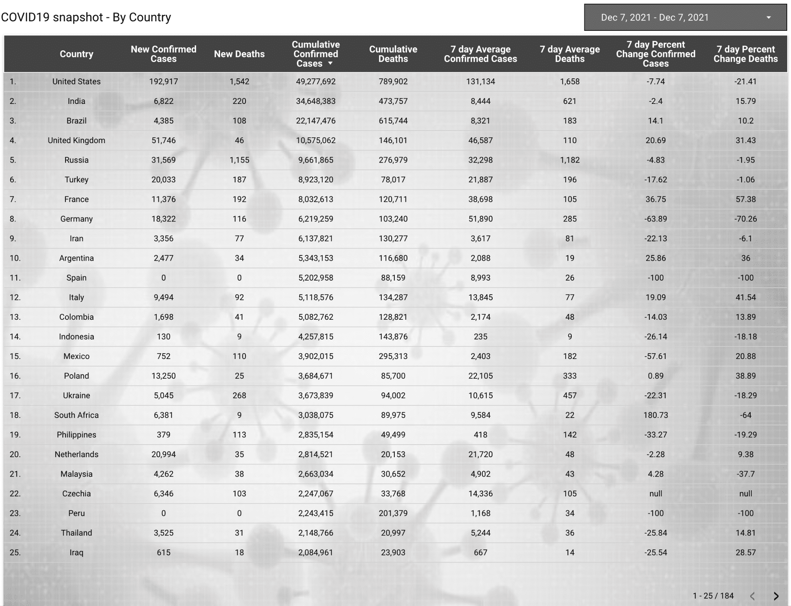

## COVID19 snapshot - By Country

This Looker Studio report shows the tabular view of all the COVID19 KPI's by country as of December 7,2021.

*Report Link:*  
[https://lookerstudio.google.com/reporting/1908f25f-09f5-474a-bd0e-6214acbf06df/page/SHKzB?s=jPIVvvqrYdY](https://lookerstudio.google.com/reporting/1908f25f-09f5-474a-bd0e-6214acbf06df/page/SHKzB?s=jPIVvvqrYdY)  

*BigQuery SQL Code:*  

~~~~
SELECT
   a.*,
   b.country,
   b.country_incomegroup,
   b.country_region,
   b.country_gdp_usd
FROM abar_bq_dataset_covid19_dw_bi.fact_daily_country_covid_metrics a 
INNER JOIN
   (
      SELECT DISTINCT
       country_lat,
       country_lng,
         country_code_iso2,
         country,
       country_incomegroup,
       country_region,
         country_gdp_usd
      FROM
         abar_bq_dataset_covid19_dw_bi.region_dim b 
   ) b 
   ON a.country_code_iso2 = b.country_code_iso2
;
~~~~