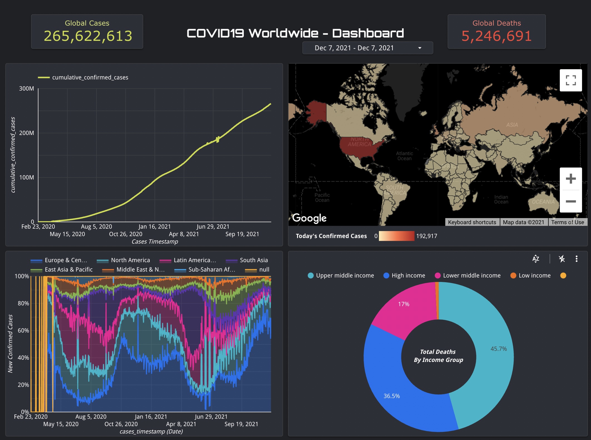

## COVID19 Worldwide - Snapshot

This Google Data Studio report shows the dashboard view of all the COVID19 KPI's as of 2 days ago.

*Report Link:*  
[https://datastudio.google.com/s/vfBK4vbpKGQ](https://datastudio.google.com/s/vfBK4vbpKGQ)  

*BigQuery SQL Code:*  

~~~~
SELECT
   a.*,
   b.country,
   b.country_incomegroup,
   b.country_region,
   b.country_gdp_usd
FROM abar_bq_dataset_covid19_dw_bi.fact_daily_country_covid_metrics a 
INNER JOIN
   (
      SELECT DISTINCT
       country_lat,
       country_lng,
         country_code_iso2,
         country,
       country_incomegroup,
       country_region,
         country_gdp_usd
      FROM
         abar_bq_dataset_covid19_dw_bi.region_dim b 
   ) b 
   ON a.country_code_iso2 = b.country_code_iso2
;
~~~~